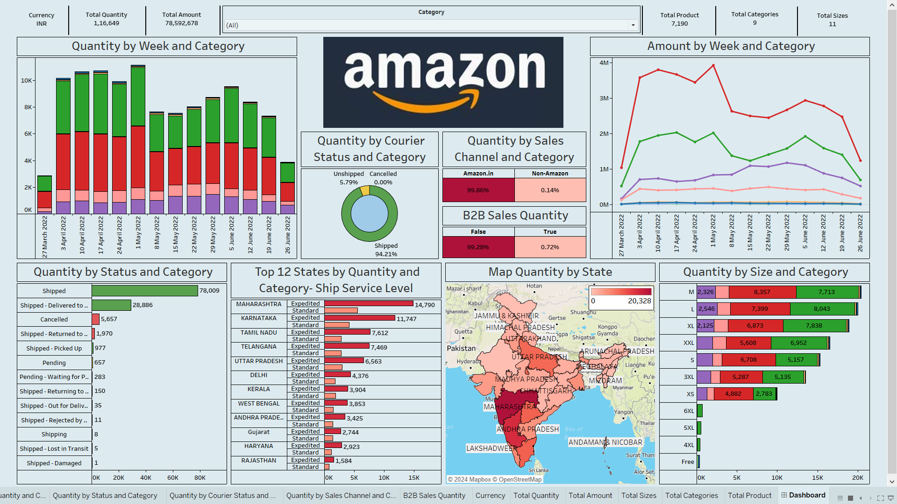

# 📈 Amazon Sales in India Dashboard

This repository contains a **Tableau workbook** that visualizes Amazon India sales data using a series of interactive dashboards. The primary goal of the project is to uncover **sales trends**, **product performance**, and **logistics insights** from e-commerce transaction data.


---

## 📁 Repository Contents

- **Amazon Sales in India Dashboard.twb**  
  Tableau workbook file containing all dashboards, worksheets, and calculated fields.
- **Dashboard.png**  
  Image preview of the full dashboard.
- **Dataset- Amazon Sale Report.rar**  
  Compressed archive of the original data source (.csv).

---

## 📊 Dashboard Overview

The workbook includes multiple dashboards categorized into the following analytical areas:

### 1. 🌐 Geospatial Analysis
- **Map of Quantity by State**: Choropleth map visualizing quantity of items shipped across Indian states.

### 2. 📅 Temporal and Category-Based Trends
- **Bar Chart – Quantity by Week and Category**  
- **Line Chart – Amount by Week and Category**

### 3. 📦 Product-Level Analysis
- **Bar Chart – Quantity by Size and Category**  
- **Bar Chart – Top 12 States by Quantity and Category - Ship Service Level**

### 4. 🚚 Logistics and Fulfilment
- **Bar Chart – Quantity by Status and Category**  
- **Donut Chart – Quantity by Courier Status and Category**  
- **Square Chart – Quantity by Sales Channel and Category**  
- **Square Chart – B2B Sales Quantity**

---

## 🧮 Data Dictionary

### 📐 Dimensions
- `Index`, `Order ID`, `Date`, `Status`, `Fulfilment`, `Sales Channel`, `Ship-Service-Level`, `Style`, `SKU`, `Category`, `Size`, `ASIN`, `Courier Status`, `Ship-City`, `Ship-State`, `Ship-Postal-Code`, `Ship-Country`, `Promotion-Ids`, `B2B`, `Fulfilled-By`

### 📊 Measures
- `Qty`, `Currency`, `Amount`

### 🧠 Calculated Fields
- `Currency1`: Standardized currency field.  
- `Total Quantity`, `Total Amount`, `Total Sizes`, `Total Categories`, `Total Product`: Aggregation metrics for dashboard KPIs.

---

## 🛠️ Requirements

- **Software**: [Tableau Desktop](https://www.tableau.com/products/desktop)  _(Recommended Version: 2021.4 or later)_

- **Data Source**: Ensure that the local data file used in the Tableau workbook is available and connected when prompted.

---

## 🚀 Deployment Instructions

1. Clone or download this repository:
   ```bash
   git clone https://github.com/piyushmtech2252/Amazon-Sales-in-India-Dashboard.git
2. Extract the Dataset- Amazon Sale Report.rar archive to retrieve the raw data file (CSV/Excel).
3. Open `Amazon Sales in India Dashboard.twb` using Tableau Desktop.
4. If Tableau prompts for missing data:
   - Go to Data → Edit Connection
   - Re-link the workbook to the extracted data file
5. Use filters (e.g., Category, Date, State) to interact with the dashboard.

---

## 🖼️ Dashoard Preview



---

## 📬 Author

**Piyush Agarwal**  
M.Tech in Software Engineering  
Delhi Technological University  

📧 piyushmtech2252@gmail.com


